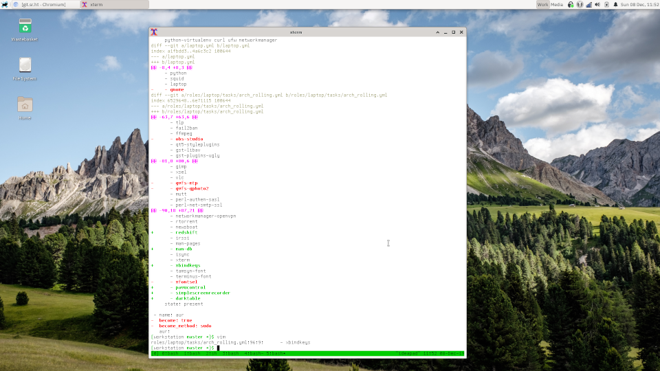

# workstation

> Development laptop setup

### About

This is a set of Ansible roles that will set up my laptop with the current development stack I use.

I used to use an Ubuntu base now I use an Arch base. Both are represented in this
repo and the submodules it uses, but the Arch configs are much more up to date.

### Related

- [dotfiles](https://git.sr.ht/~roryrjb/dotfiles)
- [ansible-roles](https://git.sr.ht/~roryrjb/ansible-roles)
